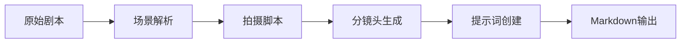

# 🧶 StoryLoom

> 故事织机 - 专为动漫短片创作设计的AI增强工具，将原始剧本编织成完整的视觉制作方案，支持分阶段执行和任务管理。

[](https://python.org)
[](LICENSE)
[](https://openai.com)

## ✨ 功能特性

- 🎬 **智能剧本解析** - AI驱动的场景结构分析和对话识别
- 👥 **角色智能提取** - 精准识别角色并生成详细人物档案和图像提示词
- 📚 **故事概览生成** - AI分析生成故事主题、梗概和特色
- 🎨 **自定义样式** - 支持用户自定义视觉风格，AI自动完善样式定义
- 📝 **专业拍摄脚本** - 生成整合分镜设计的专业拍摄脚本
- 🖼️ **Midjourney提示词** - 生成完整版(英文)、完整版(中文)、简单版提示词
- 📋 **任务管理** - 分阶段执行，支持任务ID追踪和数据持久化
- 🤖 **AI增强** - 支持OpenAI兼容API，智能分析剧本结构
- ⚡ **高效批处理** - 分镜提示词批量生成，避免重复处理

## 🚀 快速开始

### 安装

```bash
# 克隆项目
git clone https://github.com/looneyren/StoryLoom.git
cd StoryLoom

# 安装依赖
pip install -r requirements.txt
```

### 🎯 分阶段执行（推荐）

**第一步：主要分析**
```bash
# 执行场景解析、角色提取、分镜设计
python3 storyloom.py examples/yyds.txt --style=kyoani

# 输出示例：
# 📋 任务ID: abc12345
# ✅ 主要分析完成！
```

**第二步：生成图像提示词（可选）**
```bash
# 使用返回的任务ID生成图像提示词
python3 storyloom.py --generate-prompts abc12345

# ✅ 图像提示词生成完成！
```

### 📁 输出结构

```
output/
├── tasks/              # 任务信息
│   └── abc12345.json   # 任务配置和状态
└── abc12345/           # 任务输出目录
    ├── scenes.json     # 场景数据
    ├── characters.json # 角色数据  
    ├── shots.json      # 分镜数据
    ├── image_prompts.json    # 图像提示词数据
    ├── main_report.md        # 主要分析报告
    └── complete_report.md    # 完整制作方案
```

### 🤖 AI智能模式

#### 环境变量配置（推荐）

**方式1：使用 .env 文件**
```bash
# 复制示例配置文件
cp .env.example .env

# 编辑 .env 文件，填入您的API配置
# 然后直接运行
python3 storyloom.py examples/yyds.txt --style=ghibli

# 使用自定义风格
python3 storyloom.py examples/yyds.txt --custom-style="赛博朋克:未来主义科幻风格，霓虹灯效果，暗色调"
```

**方式2：系统环境变量**
```bash
# OpenAI
export OPENAI_API_KEY="your-openai-key"
export OPENAI_BASE_URL="https://api.openai.com/v1"
export OPENAI_MODEL_NAME="gpt-4"

# 智谱AI
export OPENAI_API_KEY="your-zhipu-key"
export OPENAI_BASE_URL="https://open.bigmodel.cn/api/paas/v4/"
export OPENAI_MODEL_NAME="glm-4.5"

# DMX API
export OPENAI_API_KEY="your-dmx-key"
export OPENAI_BASE_URL="https://www.dmxapi.com/v1"
export OPENAI_MODEL_NAME="gpt-4o"

# 运行工具
python3 storyloom.py examples/yyds.txt --style=shinkai
```

#### 命令行参数

```bash
# 使用OpenAI API
python3 storyloom.py examples/yyds.txt --api-key your-key

# 使用其他兼容OpenAI的服务
python3 storyloom.py examples/yyds.txt \
    --api-key your-key \
    --base-url https://api.example.com/v1 \
    --model gpt-4

# 使用自定义风格的完整示例
python3 storyloom.py examples/yyds.txt \
    --custom-style="赛博朋克:未来主义科幻风格，霓虹灯效果，暗色调" \
    --api-key your-key \
    --base-url https://www.dmxapi.com/v1 \
    --model gpt-4o \
    -o output/result
```

## 📖 使用示例

### 输入格式

创建一个文本文件，按以下格式编写剧本：

```
第1场：咖啡厅 - 白天

温暖的午后阳光透过落地窗洒进咖啡厅。

小明：今天的天气真不错呢。
小红：是啊，很适合约会。

第2场：公园 - 傍晚

夕阳西下，金色的光线穿过树叶。

小红：这里真美。
小明：和你在一起，哪里都很美。
```

### 自定义风格示例

```bash
# 使用自定义风格，格式为 "名称:描述"
python3 storyloom.py examples/yyds.txt --custom-style="赛博朋克:未来主义科幻风格，霓虹灯效果，暗色调"

# 更多示例：
python3 storyloom.py examples/yyds.txt --custom-style="温馨日常:温暖的日系风格，柔和光线，治愈系色彩"
python3 storyloom.py examples/yyds.txt --custom-style="奇幻冒险:魔法世界风格，绚丽特效，史诗级场景"
```

### 输出示例

查看 [`examples/yyds_gpt4o_output.md`](examples/yyds_gpt4o_output.md) 了解完整的输出格式。

## 🛠️ 命令行参数

| 参数 | 说明 | 示例 |
|------|------|------|
| `input` | 输入剧本文件路径 | `examples/yyds.txt` |
| `-o, --output-dir` | 输出目录路径 | `-o ./my_output` |
| `--style` | 视觉风格（内置风格） | `--style=ghibli` |
| `--custom-style` | 自定义风格（格式："名称:描述"） | `--custom-style="赛博朋克:未来主义风格"` |
| `--generate-prompts` | 为指定任务生成图像提示词 | `--generate-prompts abc12345` |
| `--style-list` | 显示所有可用风格 | `--style-list` |
| `--api-key` | OpenAI API密钥 | `--api-key sk-xxx` |
| `--base-url` | API服务地址 | `--base-url https://api.example.com/v1` |
| `--model` | 模型名称 | `--model gpt-4` |

## 🌐 支持的AI服务

工具支持所有兼容OpenAI标准的服务：

- ✅ OpenAI GPT (GPT-3.5, GPT-4, GPT-4o)
- ✅ Azure OpenAI
- ✅ DeepSeek
- ✅ 智谱AI (GLM-4, GLM-4.5)
- ✅ 通义千问
- ✅ DMX API
- ✅ 其他兼容服务

## 📁 输出格式

工具会生成包含以下内容的Markdown文件：

### 1. 拍摄脚本
- 场景设置（时间、地点、环境）
- 网络化的角色动作和情绪描述
- 标准对话标注
- 专业镜头语言建议

### 2. 分镜头表
| 场次 | 镜头号 | 镜头类型 | 时长 | 描述 | 镜头运动 | 对话 |
|------|--------|----------|------|------|----------|------|
| 1 | 1 | 远景 | 3-5秒 | 建立镜头：咖啡厅全景 | 静止 | |
| 1 | 2 | 中景 | 2-4秒 | 小明说话特写 | 轻微推进 | 今天的天气真不错呢 |

### 3. 文生图提示词
为每个镜头生成详细的AI绘画提示词，包括：
- 专业构图建议
- 现代动漫风格描述
- 网络化视觉元素
- 技术参数设置

## 🏗️ 项目结构

```
StoryLoom/
├── storyloom.py          # 主程序入口
├── script_adapter.py     # 兼容性脚本
├── task_manager.py       # 任务管理器
├── ai_service.py         # AI服务模块
├── models.py             # 数据模型
├── styles.py             # 视觉风格系统
├── requirements.txt      # 依赖列表
├── .env.example          # 环境变量示例
├── README.md             # 项目说明
├── examples/             # 示例文件
│   ├── yyds.txt         # 示例剧本
│   └── *.md             # 示例输出
└── output/               # 输出目录
    ├── tasks/           # 任务信息
    └── [task_id]/       # 任务结果
```

## 🎯 适用场景

- 🌌 **网络动漫短片** - 适合社交媒体传播的动漫制作
- 📱 **短视频创作** - 具有网感的分镜头方案
- 🎭 **剧本二创** - 从传统剧本到网络化内容的转换
- 🎨 **视觉概念** - 为美术团队提供网络化视觉参考
- 📚 **教育内容** - 将小说改编为视觉化教材
- 🎬 **独立制作** - 个人创作者的制作流程工具

## 🔧 工作流程



## ⚠️ 注意事项

1. **剧本格式** - 建议使用"第X场"标记场景，支持章节格式
2. **对话格式** - 使用"角色名：对话内容"格式
3. **模型选择** - 更高级的模型（如GPT-4）能提供更好的网感和创意
4. **API限制** - 注意API调用频率和token限制
5. **文件编码** - 确保文本文件使用UTF-8编码
6. **自定义风格** - 使用`--custom-style="名称:描述"`格式定义风格，AI会自动完善风格定义
7. **分阶段执行** - 推荐先运行主分析，再根据需要生成图像提示词以节省资源

## 🤝 贡献指南

我们欢迎各种形式的贡献！

1. Fork 项目
2. 创建功能分支 (`git checkout -b feature/AmazingFeature`)
3. 提交更改 (`git commit -m 'Add some AmazingFeature'`)
4. 推送到分支 (`git push origin feature/AmazingFeature`)
5. 打开 Pull Request

## 📄 许可证

本项目采用 MIT 许可证 - 查看 [LICENSE](LICENSE) 文件了解详情。

## 🙏 致谢

- 感谢所有贡献者的努力
- 感谢 OpenAI 提供的强大AI能力
- 感谢各个AI服务提供商的支持

## 📞 联系我们

- 提交 Issue：[GitHub Issues](https://github.com/looneyren/StoryLoom/issues)
- 讨论：[GitHub Discussions](https://github.com/looneyren/StoryLoom/discussions)

---

<div align="center">

**StoryLoom - 编织故事与视觉的桥梁，让创意成为现实**

⭐ 如果这个项目对你有帮助，请给我们一个星标！

</div>